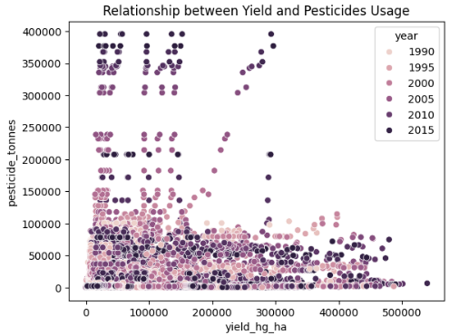
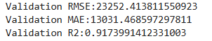
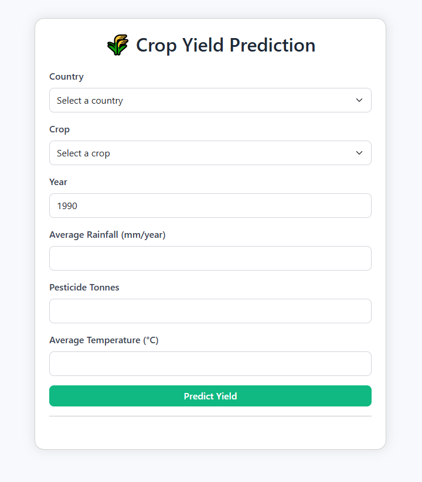

# Crop Yield Prediction using Machine Learning


## 1. Problem Statement

### Background
Agricultural productivity is a critical factor influencing food security and the economy of many nations. Farmers and policymakers often struggle to predict crop yield accurately due to varying environmental, soil, and climatic conditions. Traditional prediction methods rely heavily on expert judgment and historical averages, which are often inaccurate under changing climate patterns.

### Objectives
- To develop a data-driven model that predicts crop yield (hectograms per hectare) based on key environmental and agricultural features.
- To identify which factors (e.g., rainfall, temperature, pesticide use) most influence yield outcomes.
- To provide an easy-to-use **REST API** for yield prediction and decision support.
- To provide a simple front-end application for accessing the model. 

### Challenges
- Handling data inconsistencies and missing values across multiple countries and years.  
- Accounting for diverse climatic and soil conditions.  
- Selecting and tuning models that generalize well across different crops and regions.

### Expected Outcome
- A trained machine learning model capable of accurately predicting crop yield.  
- A user-friendly **Flask web service** for real-time predictions. 
- A reproducible, containerized ML pipeline deployable to the cloud.

---

## 2. Dataset Description

**Source:** [Crop Yield Prediction Dataset – Kaggle](https://www.kaggle.com/datasets/patelris/crop-yield-prediction-dataset/data)

### Raw Data Files

- rainfall.csv — Contains annual average rainfall data (in mm/year) for different countries.

- temp.csv — Contains average annual temperature (°C) by country and year.

- pesticides.csv — Records total pesticide usage (tonnes) for each country and year.

- yield.csv — Provides actual crop yield data (hg/ha) for multiple crops.

### Data Processing

The raw datasets were merged and cleaned through preprocessing steps to create a unified dataset, **yield_final**, containing the following key features: Country, year, crop, average rainfall, average temperature and pesticides used. 


### Dataset Highlights
- Contains crop production data for multiple countries and crops.
- Time range: Several decades (covering yearly statistics).
- Combines agricultural, climatic, and chemical use data.

### Features
| Feature | Description |
|----------|--------------|
| `country` | Name of the country |
|  `crop`   | Type of crop (e.g., rice, maize, wheat, etc.) |
| `year` | Observation year  |
| `yield_hg_ha` | crop yield in hectogram per hectare |
| `average_rain_fall_mm_per_year` | Mean rainfall per year in mm |
| `pesticide_tonnes` | Amount of pesticide used in tonnes |
| `avg_temp` | Average temperature in °C |


**Target Variable:**  
` yield_hg_ha ` — Yield per hectare (hectograms per hectare).

## 3. Technology Stack

| Layer | Tools / Libraries |
|--------|-------------------|
| **Language** | Python 3.11 |
| **Data Processing** | Pandas, NumPy |
| **Visualization** | Matplotlib, Seaborn |
| **Modeling** | Scikit-learn, XGBoost |
| **Web Framework** | Flask |
| **Model Serialization** | Pickle |
| **Containerization** | Docker |
| **Cloud Deployment** | Hugging Face Spaces (Docker Space) |
| **Version Control** | Git, GitHub |

---

## 4. Folder Structure


---
## 5. Application Workflow

### Step 1: Data Preprocessing

**Notebook:** [01_data_preprocessing.ipynb](./notebooks/01_data_preprocessing.ipynb)

This step focuses on preparing and cleaning the raw datasets to ensure data consistency, accuracy, and readiness for modeling.

#### Key Tasks

- **Data Type Conversion**  
  Ensured all columns have appropriate data types (e.g., numeric, categorical, datetime).

- **Column Normalization**  
  Standardized column names to follow a consistent naming convention (e.g., lowercase, underscores instead of spaces).

- **Feature Standardization**  
  Unified feature scales and standardized feature naming across all datasets.

- **Irrelevant Columns Removal**  
  Dropped unnecessary or redundant columns that do not contribute to analysis.

- **Data Filtering**  
  Filtered records to retain only relevant field values and regions of interest.

- **Data Cleansing**  
  - Detected and handled outliers appropriately.  
  - Filtered categorical values to maintain data integrity.  
  - Addressed missing values and removed duplicate records.

- **Dataset Merging**  
  Combined the transformed **rainfall**, **pesticide**, and **temperature** datasets with the **crop yield** dataset into a unified dataset.

- **Final Validation**  
  Conducted a final imputation step to fill any remaining missing values with column-wise means.

- **Output**  
  Exported the cleaned and consolidated dataset as **`yield_final.csv`** for subsequent analysis and modeling.

-----------------

### Step 2: Exploratory Data Analysis (EDA)

**Notebook:** [02_EDA.ipynb](./notebooks/02_EDA.ipynb)

This step involves exploring and understanding the dataset through statistical summaries and visualizations to identify key patterns, trends, and relationships.

#### Key Analyses

- **Dataset Overview**  
  Reviewed dataset structure, feature statistics, and value distributions to gain an initial understanding of data characteristics.

- **Feature Correlation**  
  Analyzed correlations among numerical features to identify potential relationships and multicollinearity.

  

    **Key Insights:**  
    - There's a moderate correlation between `avg_temp` and `average_rain_fall_mm_per_year`, i.e when average temperature grows, the average rainfall grows as well.
    - In tropical or monsoon regions, warmer air holds more moisture → more rainfall (positive correlation).
    - In arid or continental regions, higher temps mean less rainfall due to drought and evaporation (negative correlation).
    
    Since the dataset is global and multi-year, those patterns average out → resulting in a moderate positive correlation (like 0.3–0.4).

    - The correlation coefficient between `yield_hg_ha` and `avg_temp` is -0.14. It indicates that higher temperatures correspond to (moderately) lower yields.

- **Average Yield by Country**  
  Examined the average crop yield across different countries to understand regional variations.

  

    **Key Insights:**
    - UK produces the highest crop yields, followed by Belgium and Denmark

- **Average Yield Over Years by Crop**  
  Investigated yield trends for various crops over time to detect growth patterns or declines.

    **Key Insights:**
    - Potato yield is considerably higher than other crops. 
    - Most crop yields have remained the same over the years (with minor fluctuations).

- **Average Pesticide Usage Over the Years and its relationship with yield**  
  Explored changes in pesticide usage across years to identify long-term usage patterns.

  


    **Key Insights:**
    - Pesticides usage has gone up significantly over the last 2 decades. 
    - Over the past few years, pesticide usage has increased significantly, while crop yields have shown minimal improvement. 


- **Impact of Weather on Pesticide Usage**  
  Assessed how climatic factors such as rainfall and temperature influence pesticide application.

    **Key Insights:**
    - Pesticide usage tends to be lower during periods of lower temperature.
    - As temperatures rise, pesticide usage generally increases.


-----------------


### Step 3: Model Training and Tuning

**Notebook:** [03_train_models.ipynb](./notebooks/03_train_models.ipynb)

This step focuses on training multiple regression models to predict crop yield, optimizing model performance through hyperparameter tuning and feature scaling.

#### Preprocessing

- Applied **log transformation** and **scaling** to highly skewed features such as *average rainfall* and *pesticide usage* to stabilize variance and improve model performance.

---

#### **1. Linear Regression**

A baseline linear model was trained to establish a performance benchmark for more complex algorithms.

**Results:**  


**Model Performance Summary:**  
- The scatter plot of actual vs. predicted yield shows the linear model captures general trends but struggles with extreme values.  
- Linear Regression serves as a baseline for comparison with more complex models like Random Forest and XGBoost.  

> The full scatter plot and analysis are available in the [03_train_models.ipynb notebook](./notebooks/03_train_models.ipynb).

---

#### **2. Random Forest Regressor**

A Random Forest model was trained to capture non-linear relationships between features and crop yield. Extensive hyperparameter tuning was performed to optimize model performance while minimizing overfitting.

**Results:**  


**Hyperparameter Tuning Summary:**  
- `max_depth`, `n_estimators`, and `min_samples_leaf` were tuned.  
- Overfitting was monitored by comparing training and validation scores; the chosen hyperparameters provided a good balance between bias and variance.  
- The final model achieved robust performance across validation metrics with negligible overfitting.  

> All additional tuning plots are available in the [03_train_models.ipynb notebook](./notebooks/03_train_models.ipynb) for detailed reference.

---

#### **3. XGBoost Regressor**

The XGBoost model was implemented to leverage gradient boosting for improved prediction accuracy and generalization.

**Results:**  


**Hyperparameter Tuning Summary:**  
- Key hyperparameters (`eta`, `max_depth`, `min_child_weight`) were optimized.  
- Model performance was evaluated on validation data to prevent overfitting.  
- The final configuration achieved the best balance of bias and variance across all metrics.  

> Detailed hyperparameter tuning plots are available in the [03_train_models.ipynb notebook](./notebooks/03_train_models.ipynb) for reference.

---

#### Summary 
Each model was evaluated using standard regression metrics such as **R²**, **MAE**, and **RMSE**. While Linear Regression provided a baseline, Random Forest and XGBoost demonstrated superior performance, with XGBoost achieving the best balance between bias and variance.

---

### Step 4: Model Deployment (API Development)

This step focuses on deploying the trained model as a scalable and accessible API service, allowing users or applications to make real-time yield predictions.

#### Overview

A **Flask-based REST API** was developed to serve the trained model.  
The API provides endpoints for making predictions using the preprocessed and serialized model artifact.

#### Features

- **Model Serving:**  
  Loads the trained model and exposes a `/predict` endpoint for yield prediction based on input features such as rainfall, temperature, and pesticide usage.

- **Input Validation:**  
  Ensures incoming data is validated and formatted correctly before prediction.

- **Response Handling:**  
  Returns predicted yield values in a structured JSON format.

-----------------

## 6. Instructions to Reproduce

### A. Run Locally (Not Codespaces)

**Step 1: Clone the Repository**
```bash
git clone https://github.com/<your-username>/crop-yield-prediction.git
cd crop-yield-prediction
```

**Step 2: Install Pipenv**

```bash
pip install pipenv 
```

**Step 3: Install Dependencies via Pipenv**

```bash 
pipenv install --deploy --ignore-pipfile
```

**Step 4: Activate pipenv and run the Flask App**

```bash
pipenv shell
cd scripts
python serve.py 
```

**Step 5: Test the API**

You can send a POST request to test prediction. Example Below:

```bash
curl -X POST -H "Content-Type: application/json" \
     -d '{
           "country": "albania",
           "crop": "soybeans",
           "year": 2016,
           "average_rain_fall_mm_per_year": 480.0,
           "pesticide_tonnes": 14190,
           "avg_temp": 18
         }' \
     http://localhost:7860/predict
```
Or, simply open [scripts/serve-test.ipynb](./scripts/serve-test.ipynb) and run the notebook to test predictions interactively.


You’ll receive a JSON response similar to:

```json
{
  "predicted_yield": 20016.26
}
```


---

### B. Using Docker

**Step 1: Build the Docker Image**

```bash
$ docker build -t crop-yield-app .
```

**Step 2: Run the Docker Container**

```bash
$ docker run -it --rm -p 7860:7860 crop-yield-app

$ docker run -it --rm --entrypoint=bash crop-yield-app # overriding entry point to start with a shell. 
```

**Step 3: Go to http://localhost:7860/ to test the app**



---

C. Cloud Deployment

You can run this app in the cloud via **Hugging Face Spaces** using the Docker container we’ve prepared.  

**Steps to deploy or reproduce:**

1. **Push your project to GitHub**  
   Ensure your repository includes:
   - `Dockerfile`
   - `scripts/`
   - `model/`
   - `templates/`
   - `static/`

2. **Create a Hugging Face Space**  
   - Go to [Hugging Face Spaces](https://huggingface.co/spaces).  
   - Click **Create New Space**.  
   - Choose **Docker** as the SDK type.  
   - Link your GitHub repository **or** upload the project files manually.

3. **Build and run**  
   Hugging Face will automatically build the Docker container and run your app.  

4. **Access the app**  
   Once deployed, the app will be available at: `https://huggingface.co/spaces/<your-username>/<your-space-name>`

   
The live version of this app is available at:  
[Crop Yield Prediction App](https://huggingface.co/spaces/Rimsha-Bashir/Crop-Yield-Prediction-App)  

> **Note:** Free Hugging Face Spaces may take a few seconds to start after periods of inactivity.


----------------- 

## 7. Future Enhancements

- Integrate soil and humidity features for more robust predictions.

- Implement SHAP or LIME for feature explainability.

- Extend to time-series models (LSTM or Prophet) for future yield forecasting.

- Add an interactive dashboard frontend (React or Streamlit) consuming the API.

- Automate deployment with GitHub Actions + Docker CI/CD.
